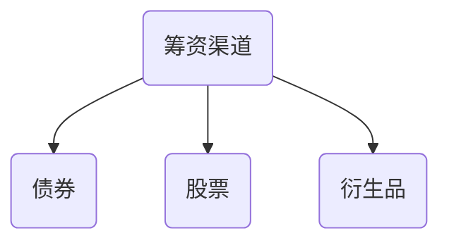
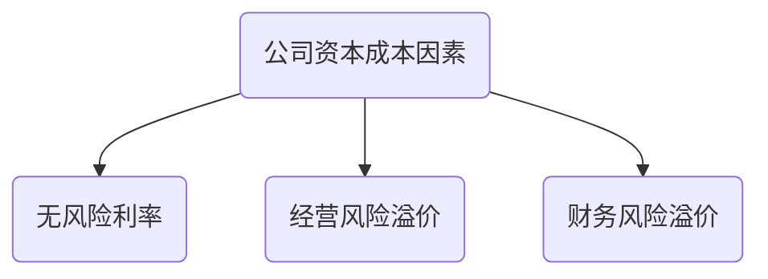
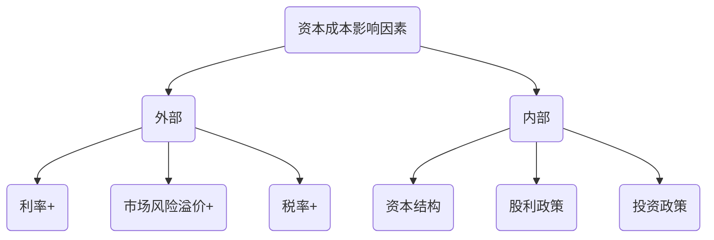

# 概念与用途

## 资本成本动机：

1. 公司需要股东财务最大化，必须考虑投入成本

$$
利润 = 收入 - 成本费用
$$

1. 公司需要增加股东财富，必须投资于高回报率项目

$$
正向回报率 = 投资回报率 - 资本成本率 > 0
$$

## 概念

### 公司资本成本

1. 是公司取得资本使用权代价

$$
投资人的税前期望报酬率 = 公司的税前资本成本
$$

2. 是公司投资人要求的必要报酬率
3. 不同资本来源资本成本不同

2. 不同的公司筹资成本不同

$$
公司资本成本 = 无风险资本成本 + 风险溢价       (资本成本定价理论)
$$

## #投资项目资本成本

1. 区分公司资本成本和项目资本成本
2. 每个项目有自己机会资本成本

## 用途

1. 用于筹资决策

   1. 筹资核心问题：决定资本结构；最优资本结构使股票价格最大化

2. 用于投资决策

   1. 净现值法

      1. $$
         净现值 = 流入现值 - 流出现值 >0 接受
         $$

   2. 内涵报酬率法

      1. $$
         0 =流入现值 - 流出现值——>折现率(内涵)
         $$

3. 用于运营资本管理

4. 用于企业价值评估（并购，重组）

5. 业绩评价（经济增加值）

## 影响因素

# 知识点地图

