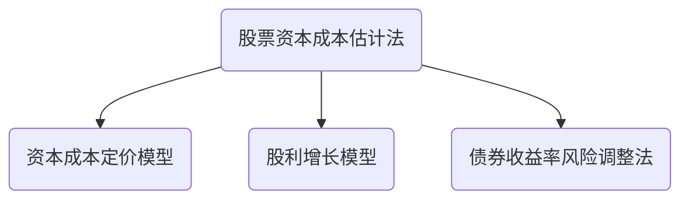

# 普通股资本成本

## 不考虑费用普通股资本成本

1. ###资本资产定价模型

   1. $$
      r_s = r_b+\beta\times(r_m-r_b)
      $$

   2. 无风险利率估计$r_b$

      1. 如何选择债券期限？

         1. 选择长期政府债券
            1. 普通股是长期有价证券
            2. 资本预算涉及的时间很长
            3. 长期政府债券利率波动较小

      2. 如何选择利率？

         1. 选择长期政府债券到期收益率

      3. 如何处理通胀问题？

         1. $$
            1+r_b=(1+r^*)(1+通货膨胀率)
            $$

         2. $$
            名义现金流量 = 实际现金流量\times(1+通货膨胀率)^n
            $$

         3. 实务中通常使用考虑通胀率的名义现金流量

         4. 使用不考虑通胀情形：

            1. 存在恶性通胀
            2. 预测期特别长

   3. 股票贝塔值估计

      1. $$
         \beta=\frac{Cov(R_i,R_m)}{O_{m}{2}}
         $$

      2. 选择有关预测期间长度？

         1. 当公司风险特征没有发生改变时，一般采用5年或更长时间数据
         2. 当公司风险特征发生改变，采用改变后的预测期长度

      3. 选择收益计量时间间隔

         1. 一般采用月收益率

      4. 贝塔驱动因素

         1. 经营杠杆
         2. 财务杠杆
         3. 收益周期

   4. 市场风险溢价估计

      1. 一般使用历史数据分析
         1. 选择时间跨度？
            1. 较长时间（衰退期+繁荣期）
         2. 权益市场收益率是算术平均or几何平均？

1. 

### 股利增长模型

$$
r_s = \frac{D_1}{P_0}+g?
$$

#### 估计长期平均增长率$g$

1. 历史增长率（历史数据分析）

   1. 算数平均or几何平均

   2. $$
      g(几何平均法)=\sqrt[n]{\frac{FV_近}{PV_远}}-1
      $$

2. 可持续增长率

   1. $$
      股利增长率= 可持续增长率=留存收益比率(不变)\times期初权益预期净利率
      $$

3. 采用证券分析师预测

### 债券收益率风险调整模型

1. 原理

   1. > 风险越大，要求的报酬越高

   2. $$
      r_s=r_b+RP_0*风险溢价*
      $$

## 考虑发行费普通股资本成本估计

$$
r_s=\frac{D_1}{P_0\times(1-F)}+g
$$

# 知识点地图

